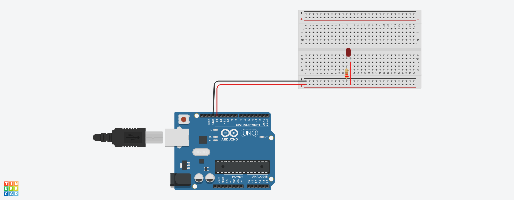

# Arduino LED Blink

This is a basic Arduino project that blinks an LED connected to digital pin 13.  
It’s a simple example to demonstrate how to use `digitalWrite()` and `delay()` functions.

## Hardware Required
- Arduino Uno
- 1x LED
- 1x 220Ω resistor
- Breadboard and jumper wires

## Circuit Diagram
- Connect the anode (+) of the LED to **pin 13**
- Connect the cathode (-) through a **220Ω resistor** to **GND**

## Code

```cpp
void setup() {
  pinMode(13, OUTPUT);
}

void loop() {
  digitalWrite(13, HIGH); // turn the LED on
  delay(1000);            // wait 1 second
  digitalWrite(13, LOW);  // turn the LED off
  delay(1000);            // wait 1 second
}
## 🖼 Circuit Diagram



